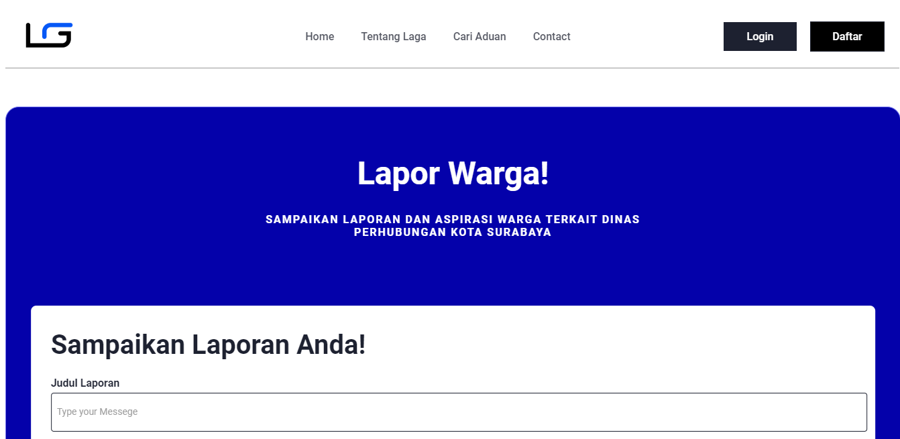
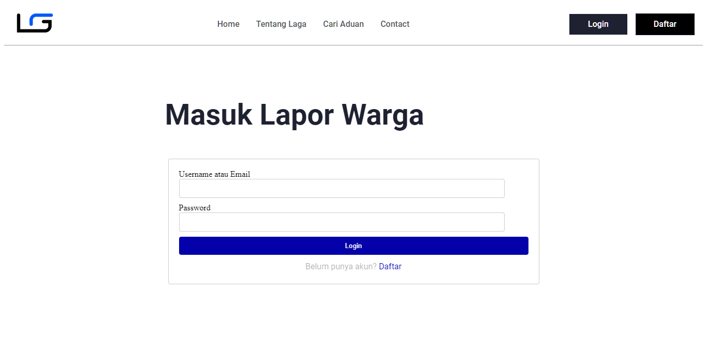

## How to Run this Project:

Here's how to run a Laravel project:

1. Clone the repository from GitHub
2. Install the required dependencies
3. Duplicate the `.env.example` file into `.env` and customize the settings inside the `.env` file with database settings and other configurations.
4. Generate the application key: php artisan key:generate
5. Run the migration (if required): php artisan migrate
6. Run the local server: php artisan serve

Make sure you have PHP and Composer installed before running your Laravel project.

## Preview Laga

Here is a view :

-   Home Page:
    

-   Cari Aduan Page:
    

-   Login Page:
    
